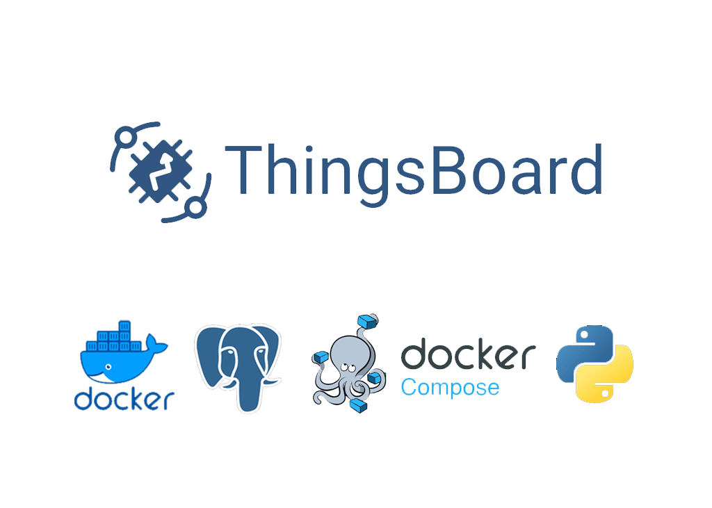

<h1 align="center">ThingsBoard MQTT Docker</h1>


<div align="center" ><a href="https://easy-iot.ir"></a></div>

<h3 align="center">the minimalist deployment of things board and interact with it with python and mqtt</h3>
<p align="center">
<a href="https://www.python.org" target="_blank">  </a>
<a href="https://www.micropython.org/" target="_blank">  </a> 
<a href="https://nodejs.org/en/" target="_blank">  </a>
<a href="https://www.easy-iot.ir/" target="_blank">  </a>  
<a href="#" target="_blank">  </a> 
<a href="https://mqtt.org/" target="_blank">  </a> 
<a href="https://thingsboard.io" target="_blank">  </a> 
</p>

### Overview
- [Setup](#setup)
- [Post Setup](#post-setup)
- [MQTT Usage](#mqtt-usage)
- [More Examples](#more-examples)
- [License](#license)
- [Bugs or Opinion](#bugs-or-opinion)


# Setup
in order to setup the thingsboard platform and use it in your pc all you have to do is to run the docker-compose file i made for it, this the image of things board is based on postgres and in memeory ram usage for testing pruposes.
you can always change it to your needs with the link below:
<https://thingsboard.io/docs/user-guide/install/installation-options/>

```yaml
version: '3.9'

services:
  thingsboard:
    container_name: thingsboard
    restart: always
    image: "thingsboard/tb-postgres"
    ports:
      - "8080:9090"
      - "1883:1883"
      - "7070:7070"
      - "5683-5688:5683-5688/udp"
    environment:
      TB_QUEUE_TYPE: in-memory
    volumes:
      - ./thingsboard/data:/data
      - ./thingsboard/logs:/var/log/thingsboard

```
# Post Setup
After executing the compose command you can open http://{your-host-ip}:8080 in your browser (for ex. http://localhost:8080). You should see ThingsBoard login page. Use the following default credentials:

- System Administrator: sysadmin@thingsboard.org / sysadmin
- Tenant Administrator: tenant@thingsboard.org / tenant
- Customer User: customer@thingsboard.org / customer
- 
You can always change passwords for each account in account profile page.

reference: <https://thingsboard.io/docs/user-guide/install/docker-windows/>

# MQTT Usage
for using mqtt api in thingsboard all you have to do is to declare a device and attach an access_token to it, then you can use that access_token as username and send data to things board public topic as ```v1/devices/me/telemetry``` and use those data for process or visualizations.
the script bellow shows the most simplest way to use in paho library for python:
```python
import paho.mqtt.publish as publish
import random
import json 

# MQTT broker details
broker_address = "localhost"  # Replace with your ThingsBoard MQTT broker address
broker_port = 1883  # Default MQTT port for ThingsBoard

# Access token of the device/entity in ThingsBoard
access_token = "thgkpgelq58omt9m7ze4"  # Replace with the actual access token

# MQTT topics
telemetry_topic = "v1/devices/me/telemetry"  # Telemetry topic for sending data to ThingsBoard


# Create a payload with the data to be sent
payload = {
    "temperature": random.randrange(25,30),
    "humidity": random.randrange(30,50),
    "pressure": random.randrange(900,1200)
}
payload_json = json.dumps(payload)

publish.single(
    telemetry_topic,
    payload=payload_json,
    hostname=broker_address,
    port=broker_port,
    auth={'username': access_token, 'password': ""}
)
```
# More Examples
you can find more examples of communicating though mqtt with different languages in examples directory.


# License
MIT

# Bugs or Opinion
Feel free to let me know if there are any problems or any request you have for this repo.
